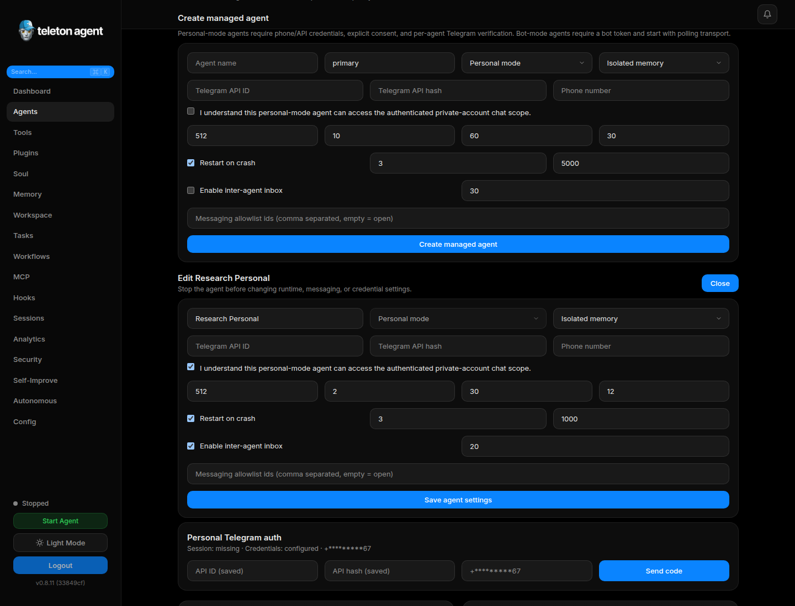
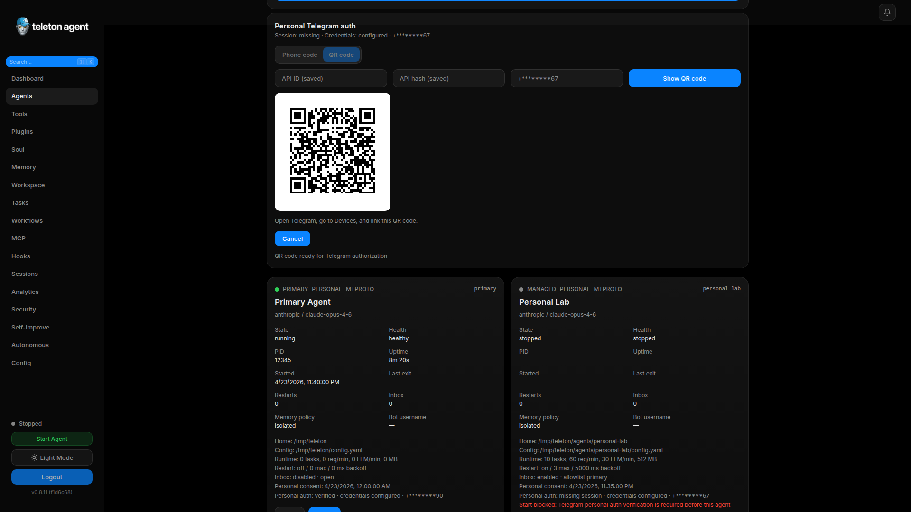

# Quick Start

Teleton Agent is an autonomous Telegram and TON agent with a WebUI for setup, monitoring, configuration, and daily operations. Use this page when you are launching a fresh installation or orienting a new operator.

## Screenshots





## Requirements

- Node.js 20 or newer.
- One LLM provider key, unless you use a keyless provider such as Claude Code, Cocoon, or a local server.
- A dedicated Telegram account or bot token.
- Telegram API ID and API hash from `my.telegram.org/apps` for personal account mode.
- Your Telegram numeric user ID for `telegram.admin_ids`.

Do not connect a personal Telegram account that you are unwilling to automate. The agent can read dialogs, send messages, and execute enabled tools within the policies you configure.

## Install

```bash
npm install -g teleton@latest
teleton setup --ui
```

For source development:

```bash
git clone https://github.com/TONresistor/teleton-agent.git
cd teleton-agent
npm install
npm run build
npm run dev:cli -- setup --ui
```

## First Setup

1. Open the URL printed by `teleton setup --ui`.
2. Choose an LLM provider and model.
3. Authenticate Telegram by QR code or phone code.
4. Add at least one admin ID.
5. Decide whether to enable the WebUI after setup.
6. Review the generated configuration and start the agent.

The setup wizard stores the raw WebUI login token only once. Keep that token in your password manager. Later launches use the hashed token from `config.yaml`.

## First Login

Start the dashboard:

```bash
teleton start --webui
```

Open the local WebUI URL and paste the auth token. After login, the sidebar gives access to Dashboard, Agents, Tools, Memory, Tasks, Workflows, MCP, Hooks, Sessions, Analytics, Security, Autonomous Mode, and Configuration.

## First Task

1. Open `Autonomous`.
2. Select `+ New task`.
3. Describe the goal in natural language, for example:

```text
Monitor new DeDust pools every 5 minutes and report to @ton_ops
when more than 3 pools appear.
```

4. Use `Parse with AI` to fill the structured fields.
5. Review success criteria, restricted tools, strategy, priority, iteration limit, and budget.
6. Save and start the task.

## Verify Operation

Use Dashboard for live status and `Sessions` for chat history. Use `Security` to review audit events after changing settings or running sensitive tools.

## Recovery Checklist

- If WebUI login fails, restart the agent and open the startup exchange URL printed in the terminal.
- If Autonomous Mode does not start, confirm `telegram.admin_ids` is not empty.
- If Telegram auth fails, verify API ID, API hash, phone number, and any MTProto proxy settings.
- If tool calls are missing, check `Tools` scope and enabled state.
