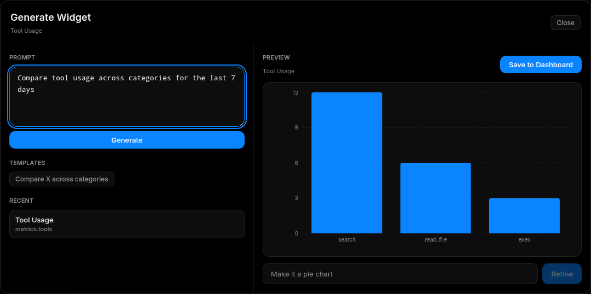

# Dashboard

Dashboard is the WebUI control room. It combines status, live logs, quick actions, metrics, dynamic widgets, cache status, predictions, and health checks.

## Screenshots

## What You See

The top area shows the current provider, model, uptime, sessions, tool count, token usage, and service health. Widgets can show status cards, logs, charts, prediction suggestions, cache resources, and generated custom views.

The sidebar remains available for navigation, agent start/stop controls, theme switching, and logout. The command palette is opened from the search control or with `Ctrl+K` / `Cmd+K`.

## Daily Workflow

1. Check the agent state in the lower sidebar.
2. Review warning banners or unread notifications.
3. Look at token, tool, and activity widgets for unusual spikes.
4. Use Quick Actions for low-risk operations such as log export or cache cleanup.
5. Open generated widgets when you need a focused operational view.

## Managing Widgets

1. Select `Edit`.
2. Add a built-in widget or generate a widget from a natural-language prompt.
3. Drag and resize widgets.
4. Save the layout by leaving edit mode.
5. Export a dashboard bundle when you want to reuse a layout elsewhere.

Generated widgets are best for local operational views such as "show failed tools this week" or "compare daily token cost by provider". They should not replace source-of-truth pages such as Security Center or Configuration.

## Quick Actions

Common actions include clearing cache, exporting logs, restarting the agent, and sending a test message. Destructive or high-impact actions use confirmation dialogs.

## Good Operating Habits

- Keep a compact dashboard for daily use and a separate diagnostic dashboard for deep checks.
- Treat prediction cards as suggestions, not automatic approvals.
- Review Security Center after using quick actions that mutate configuration or runtime state.
