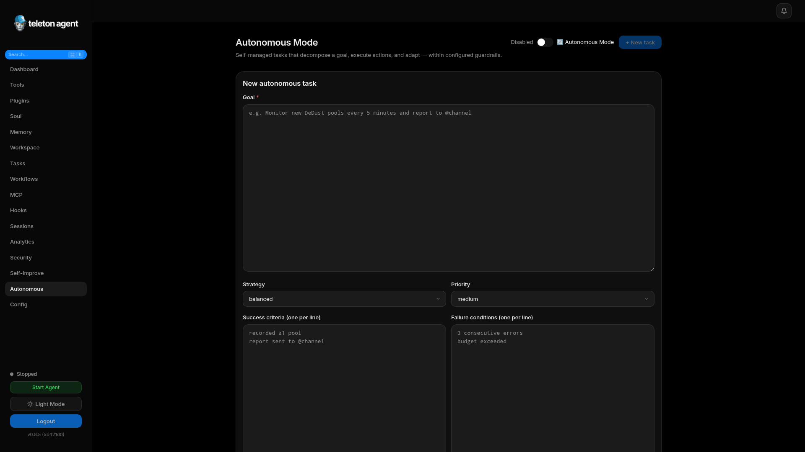
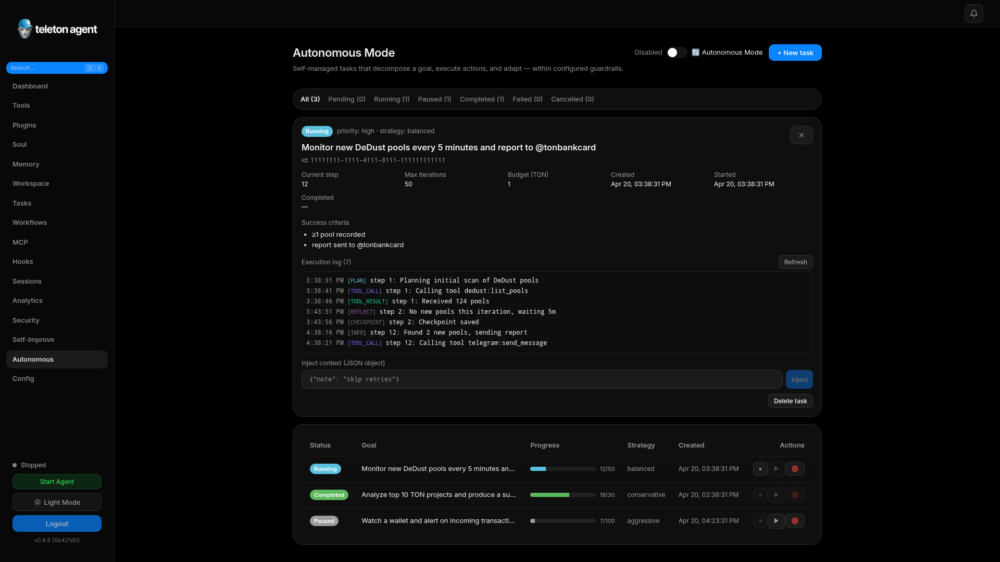
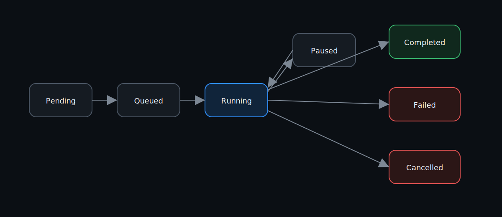
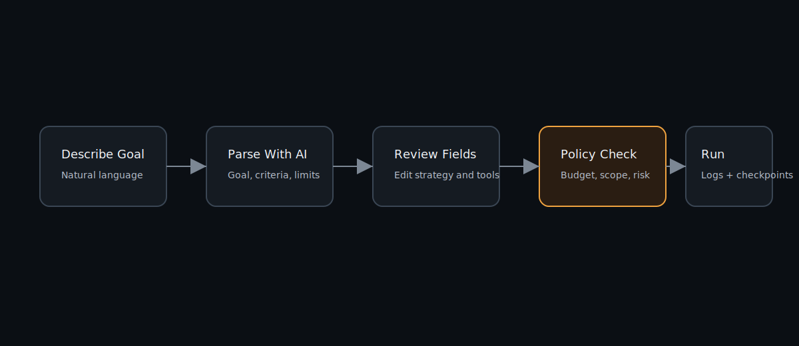

# Autonomous Mode

Autonomous Mode lets Teleton Agent run long-lived goals through a plan, act, observe, reflect, and checkpoint loop. It is disabled by default and should be enabled only after policies and admin IDs are configured.

## Screenshots

## Task Lifecycle

Tasks move through `pending`, `queued`, `running`, `paused`, `completed`, `failed`, or `cancelled`. Running tasks save checkpoints so they can resume after a restart.

## Create a Task With AI Parsing

1. Open `Autonomous`.
2. Click `+ New task`.
3. Enter a natural-language goal.
4. Click `Parse with AI`.
5. Check the extracted goal, success criteria, failure conditions, allowed tools, restricted tools, strategy, priority, iteration limit, duration limit, and budget.
6. Save and start.

## Create a Task Manually

Use the structured form when you need precise guardrails. Add one success criterion per line and one failure condition per line. Put high-risk tools such as `ton_send`, `jetton_send`, or `exec_run` in restricted tools unless the task explicitly needs them.

## Monitor Progress

The task table shows status, goal, progress, strategy, creation time, and action buttons. Open a task to inspect logs, current context, checkpoints, result, and errors.

Important log event types:

| Event | Meaning |
| --- | --- |
| `plan` | The agent selected the next action. |
| `tool_call` | A tool was invoked. |
| `tool_result` | A tool returned output. |
| `reflect` | The agent evaluated progress. |
| `checkpoint` | Recovery state was saved. |
| `escalate` | Human review is required. |
| `error` | A step failed. |

## Pause, Resume, Stop

Use pause when a task needs more context or a policy change. Use stop when the goal is no longer needed. Stopped or cancelled tasks should be recreated rather than manually revived.

## Safety Rules

- Keep `telegram.admin_ids` populated.
- Prefer `conservative` for wallet, account, or exec work.
- Set explicit budgets for TON operations.
- Restrict tools that can move funds, write files, or contact external services.
- Review Security Center for approvals and audit events.
