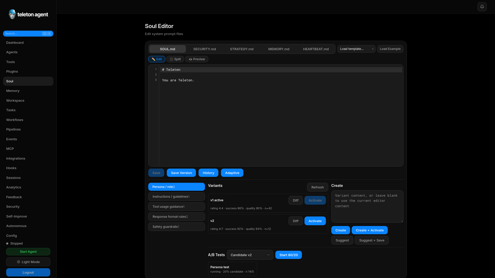
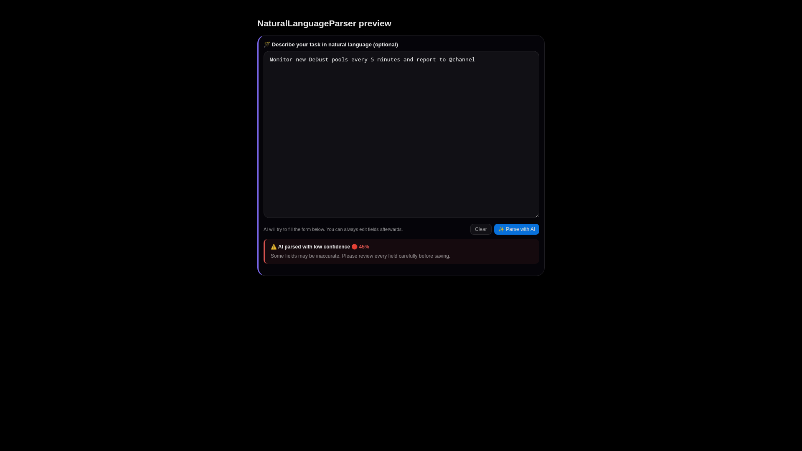

# Soul Editor

Soul Editor edits the prompt files that define the agent's identity, security posture, strategy, memory behavior, and heartbeat tasks. Changes can affect every future response.

## Screenshots

## Prompt Files

| File | Purpose |
| --- | --- |
| `SOUL.md` | Persona and operating style. |
| `SECURITY.md` | Safety rules and policy guidance. |
| `STRATEGY.md` | Planning preferences and tool-use strategy. |
| `MEMORY.md` | Persistent knowledge and memory instructions. |
| `HEARTBEAT.md` | Periodic autonomous checklist. |

## Edit, Preview, Split

Use edit mode for writing, preview mode for rendered Markdown, and split mode for reviewing formatting while editing. Drafts are auto-saved locally, but you still need to save to apply changes to the agent files.

## Templates

Templates help reset or specialize prompt behavior. Apply a template only after reviewing the diff because templates can overwrite local tone, constraints, or domain-specific rules.

## Version History

Before major prompt changes:

1. Save the current version with a short comment.
2. Make the edit.
3. Preview the Markdown.
4. Save a new version.
5. Use diff to compare behavior-critical sections.

Restore an older version when a prompt change causes regressions such as excessive tool use, unsafe replies, or poor Telegram formatting.

## Adaptive Prompting

The adaptive prompting panel manages prompt sections, variants, experiments, ratings, and optimizer suggestions. Use it for measured improvements, not emergency fixes.

Recommended pattern:

1. Create a candidate variant.
2. Start an A/B experiment with limited traffic.
3. Wait for enough samples.
4. Promote only if quality and task success improve.

## Safety Notes

- Keep security rules concrete.
- Avoid instructions that bypass confirmation or audit controls.
- Keep examples short and representative.
- Record why every major prompt version exists.
