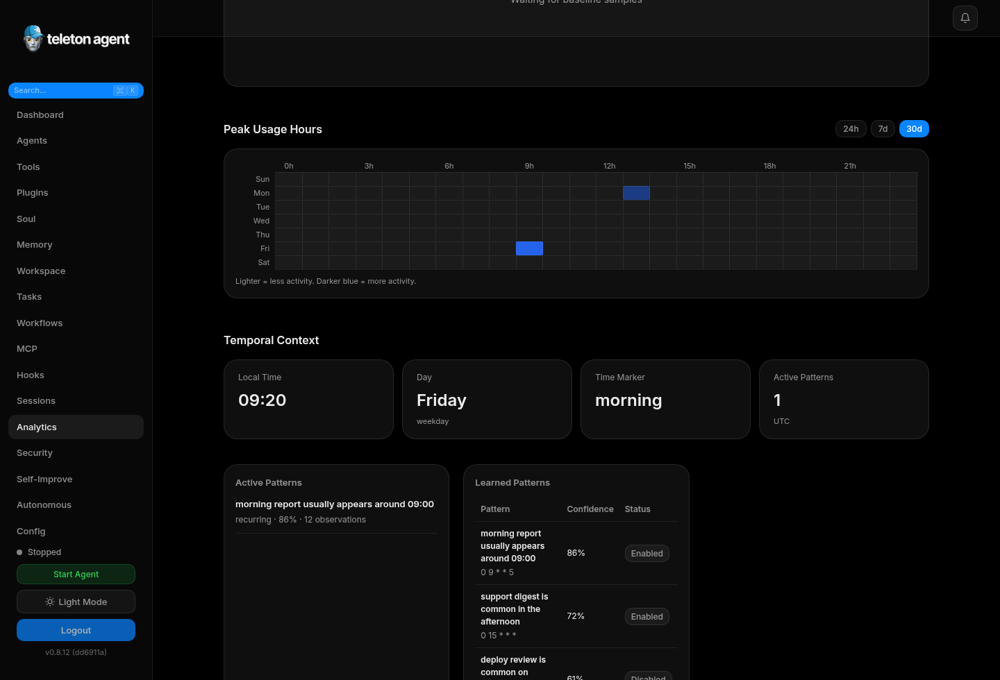
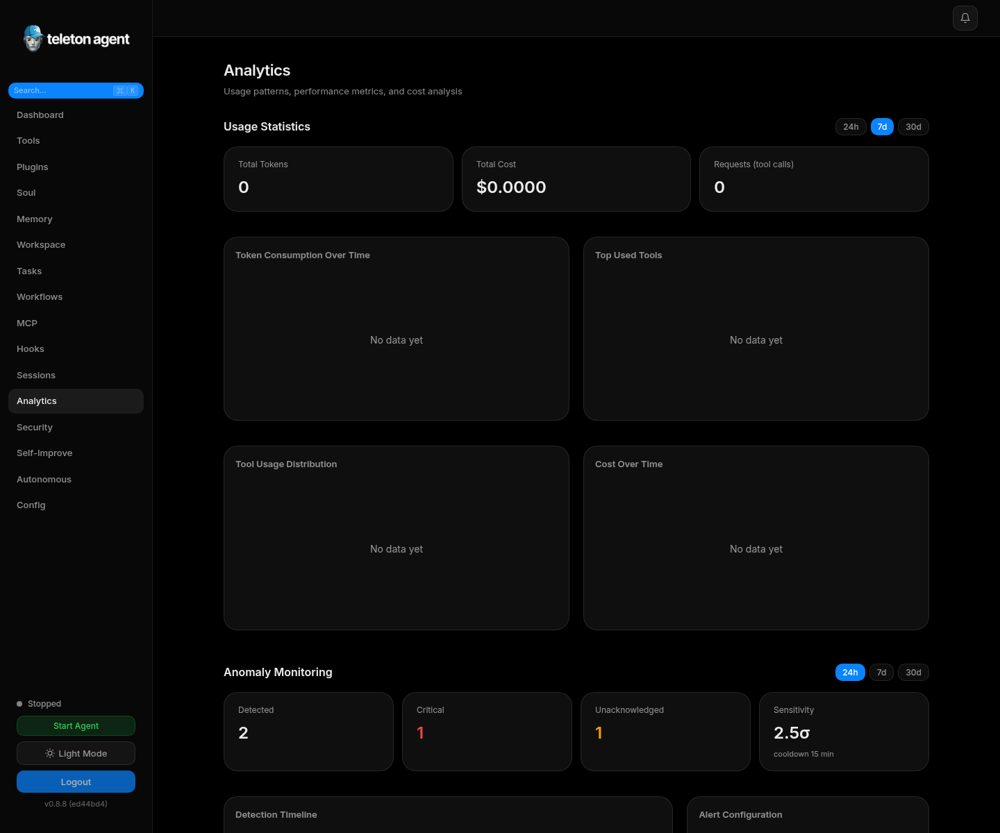

# Analytics

Analytics explains how the agent is used, where cost is going, and whether performance is healthy. It combines token metrics, tool metrics, activity heatmaps, latency, errors, budget status, temporal patterns, anomaly detection, and feedback learning.

## Screenshots

## Main Metrics

| Metric | Use |
| --- | --- |
| Token usage | Detect cost spikes and large-context workflows. |
| Tool usage | Find heavily used, failing, or unused tools. |
| Activity heatmap | See when users and tasks are active. |
| Performance | Track latency, p95 latency, success rate, and errors. |
| Cost | Estimate monthly usage and per-tool cost. |
| Budget | Compare current spend with monthly limits and projections. |

## Time Filters

Use shorter periods for incident response and longer periods for planning. If a change was deployed yesterday, start with 24 hours. For model selection and cost reviews, compare 7 or 30 days.

## Anomaly Detection

Anomaly cards highlight unusual behavior such as sudden token growth, tool errors, repeated approvals, or unexpected schedule changes. Acknowledge anomalies only after you understand the cause.

## Temporal Context

Temporal context records recurring patterns. Use it to tune schedules and heartbeat behavior. For example, if users are most active around 09:00 UTC, schedule digest tasks before that window.

## Feedback Learning

Feedback analytics shows ratings, themes, preferences, and recent feedback. Use it together with Soul Editor experiments when changing tone or response style.

## Exporting Data

Use exports for cost reviews, incident reports, and long-term trend analysis. Keep exported data secure because it can include operational timing, chat-derived metadata, and tool names.

## Review Checklist

- Token growth matches real workload.
- Tool failures are not concentrated in one module.
- Cost projection stays below budget.
- Anomalies have an owner and explanation.
- Feedback themes are reflected in prompt or policy changes.
