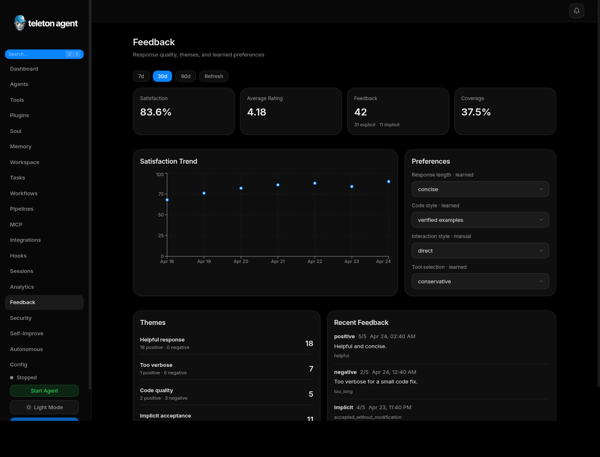
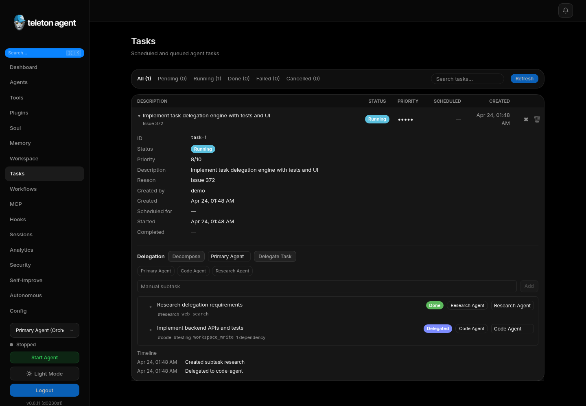

# Sessions

Sessions shows chat history and conversation metadata captured by the agent. It is used for support, context recovery, audits, and understanding why the agent took a specific action.

## Screenshots

## Session List

Each session includes chat ID, title, username, chat type, provider, model, message count, token counts, start time, and last update time. Search helps find sessions by message content.

## Inspect a Session

Open a session to review messages in order. Messages identify whether they came from the user or agent, whether media was present, edit state, timestamps, and reply relationships.

## Restore Context

Use sessions when a user asks why the agent behaved a certain way. Read the last user request, tool results, and agent reply before changing prompts or policies.

## Export a Session

Export sessions for offline audit or support handoff. Treat exported sessions as sensitive because they can contain Telegram usernames, message text, media metadata, and operational decisions.

## Corrections

Self-correction records show original output, evaluation score, reflection, corrected output, escalation state, and tool recovery guidance. Use this view to see whether the self-correcting loop improved the answer or needs prompt changes.

## Good Practices

- Filter by chat type before broad reviews.
- Use search terms that match user wording, not internal labels.
- Export only the sessions needed for the investigation.
- Do not paste sensitive session exports into public issue trackers.
- When a session reveals a policy gap, update Security Center first and Soul Editor second.
