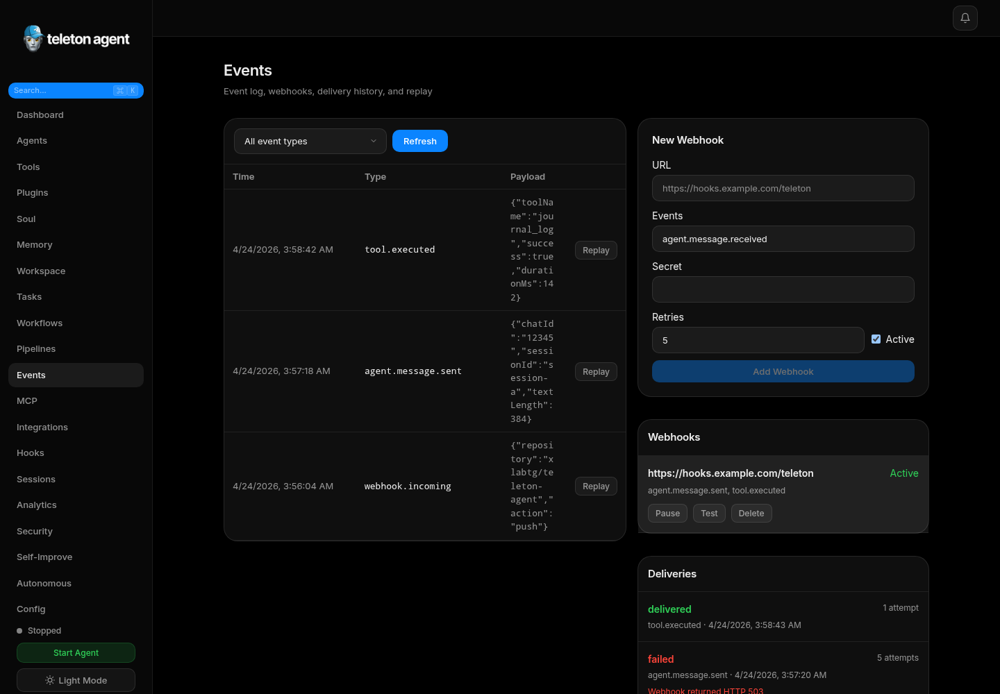

# Hooks

Hooks modify or block behavior before the agent responds. They are useful for keyword blocklists, injected context, policy reminders, and lightweight automation around incoming messages.

## Screenshots

## Keyword Blocklist

The blocklist rejects messages containing configured keywords and returns the configured response. Use it for hard stops such as seed phrases, private keys, or prohibited support topics.

## Context Triggers

Context triggers add instructions when a keyword appears. Example: a trigger for `airdrop` can inject a reminder to warn about scams before answering.

## Visual Rule Builder

Structured rules combine condition blocks and action blocks. Use the builder when one keyword is not enough or when you need several rules in priority order.

## Testing Hooks

Use the test panel before saving a new hook set:

1. Enter a representative user message.
2. Run the test.
3. Check whether the message is blocked.
4. Review triggered hooks and injected context.
5. Adjust keywords to avoid false positives.

## Hook Design Rules

- Keep blocklist terms specific.
- Prefer injected context for advice and hard block for secrets or abuse.
- Test both positive and negative examples.
- Keep rule order simple.
- Review audit logs after changing production hooks.

## Integrations

Hooks are local behavior controls. For outbound automation, use Events, Webhooks, Workflows, or Integrations instead of adding side effects directly to prompt text.
