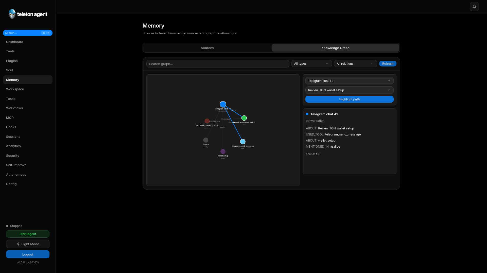

# Advanced Features

This section covers WebUI areas that extend the core dashboard into multi-agent operations, memory management, workflow automation, integrations, and self-improvement.

## Screenshots

## Multi-Agent Network

Use `Network` to register remote agents, inspect topology, view trust levels, block peers, delegate tasks, and review message logs. Capabilities and trust level should drive delegation decisions.

## Agents

The `Agents` page manages primary and managed agents. It covers archetypes, transport mode, bot token validation, personal account authentication, resource policy, messaging policy, logs, and messages.

## Memory

Memory includes source files, chunks, priority scores, graph relationships, vector sync, cleanup, and pins. Use graph view for relationship discovery and priority view for deciding what to pin or prune.

## Workspace

Workspace is the file browser for the sandboxed agent workspace. Use it for reports, generated files, task artifacts, and safe manual edits. Avoid storing secrets in workspace files.

## Workflows

Workflows automate cron, event, or webhook-triggered actions. Supported action types include sending Telegram messages, calling APIs, and setting variables.

## Pipelines

Pipelines run multi-step processes with timeouts, retries, typed steps, run history, cancellation, and detail views. They are best for repeatable research or reporting chains.

## Events and Webhooks

Events records internal activity. Webhooks deliver selected event types to external URLs with retry tracking. Use signed secrets for inbound webhook triggers.

## MCP Servers

MCP connects external tool servers through stdio, SSE, or Streamable HTTP. Define package, arguments, scope, and environment variables carefully.

## Plugins

Plugins add tools through manifests and the Plugin SDK. Review source, permissions, secrets, and tool scopes before enabling a plugin.

## Self-Improvement

Self-Improvement analyzes repositories, documentation, plugins, and tasks. Keep automation conservative and use pull requests for every generated change.
