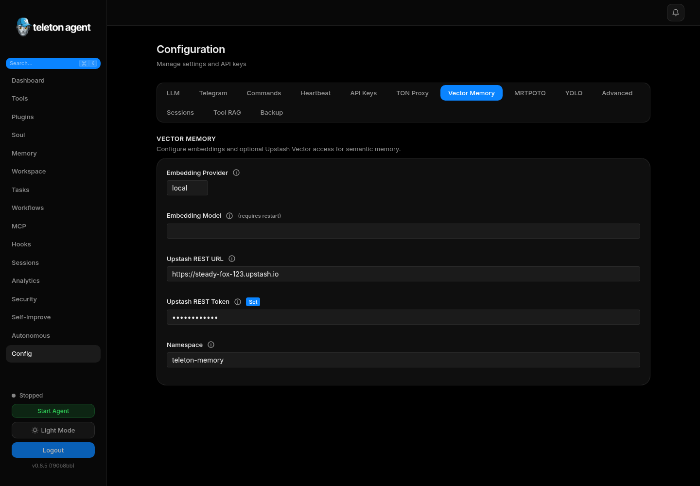

# Settings

Configuration controls the agent provider, Telegram policies, command permissions, memory, integrations, WebUI behavior, TON proxy, MTProto proxy, and export/import.

## Screenshots

## Configuration Tabs

| Area | What to configure |
| --- | --- |
| LLM | Provider, model, utility model, API keys, temperature, iteration limits. |
| Telegram | DM policy, group policy, mentions, allowlists, admin IDs, bot token. |
| Commands | Admin commands, allowed users, allowed chats. |
| Memory | Vector memory, Upstash settings, namespace, sync behavior. |
| Execution | System execution mode and allowed command prefixes. |
| WebUI | Port, request logging, auth token behavior. |
| MCP | Enablement and server-related configuration. |
| TON Proxy | `.ton` browsing proxy status and port. |
| Export/Import | Move configuration, hooks, and prompt state between installs. |

## Provider Changes

Provider changes are gated when the target provider needs a key. Enter the key, validate it, then save. If a provider has no key requirement, the change can be saved directly.

## Telegram Policies

Recommended production defaults:

- `dm_policy: admin-only` or `allowlist`.
- `group_policy: allowlist` unless public group operation is intentional.
- `require_mention: true`.
- Non-empty `admin_ids`.

## Memory Settings

Vector memory can run locally or through Upstash Vector. Confirm index dimension matches the embedding provider. After changing vector settings, run sync from Memory.

## Import and Export

Export before large changes. Import only from trusted sources because imported hooks, prompts, and tool settings can materially change agent behavior.

## Restart Requirements

Some settings hot-reload immediately. Others require an agent restart. The UI marks restart-sensitive settings, and the agent control in the sidebar can restart the runtime.
