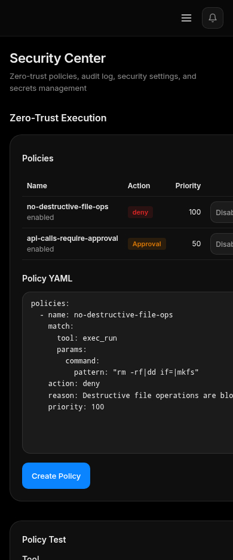

# Troubleshooting

Use this page when the WebUI, agent runtime, Telegram connection, tools, memory, or autonomous tasks do not behave as expected.

## Screenshots

## WebUI Login Fails

- Confirm you are using the current token or startup exchange link.
- Restart `teleton start --webui` and open the printed local URL.
- Check that the browser is not blocking local cookies.
- If using a reverse proxy, verify it preserves cookies and does not expose the WebUI publicly.

## Agent Does Not Respond

- Check the sidebar state and start the agent if stopped.
- Review Dashboard health checks.
- Verify Telegram session and policies.
- Confirm the user or chat is allowed by DM/group policy.
- Check recent logs and Sessions.

## Autonomous Mode Does Not Start

- Confirm `telegram.admin_ids` has at least one ID.
- Check Security Center for denied tools or pending approvals.
- Verify the task has enough iteration and duration budget.
- Make restricted tools explicit.

## Telegram Auth Problems

- Recheck API ID, API hash, phone number, and code.
- If 2FA is enabled, enter the password in the wizard.
- If your network blocks Telegram, configure MTProto proxy settings.
- For bot mode, validate the bot token and username.

## Tools Fail

- Open Tools and verify enabled state and scope.
- Use tool details to inspect parameters and recent failures.
- Check Security Center validation logs.
- For plugin tools, verify plugin secrets and dependencies.

## Memory or Vector Sync Fails

- Confirm local SQLite files are writable.
- Check Upstash URL, token, namespace, and vector dimension.
- Run vector sync again after fixing credentials.
- Pin important memories before cleanup.

## Cost or Latency Spikes

- Open Analytics and compare token usage, tool usage, and performance over 24 hours.
- Check whether autonomous tasks are looping.
- Lower iteration limits or pause noisy tasks.
- Use cache widgets to verify hit rate.

## When to Escalate

Escalate to maintainers with exact version, config area, reproduction steps, logs, screenshots, and whether the issue affects Telegram, TON, memory, tools, or WebUI only.
