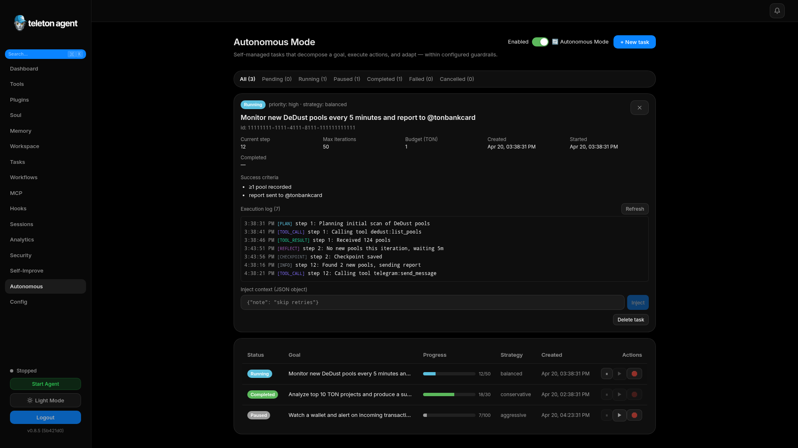

# Быстрый старт

Teleton Agent - автономный Telegram и TON агент с WebUI для настройки, мониторинга, конфигурации и ежедневной эксплуатации. Этот раздел нужен при первом запуске или onboarding нового оператора.

## Скриншоты




## Требования

- Node.js 20 или новее.
- Ключ одного LLM провайдера, если вы не используете Claude Code, Cocoon или локальный сервер.
- Отдельный Telegram аккаунт или bot token.
- Telegram API ID и API hash с `my.telegram.org/apps` для режима личного аккаунта.
- Ваш числовой Telegram user ID для `telegram.admin_ids`.

Не подключайте основной личный Telegram аккаунт, если вы не готовы автоматизировать его действия. Агент может читать диалоги, отправлять сообщения и выполнять включенные инструменты в рамках заданных политик.

## Установка

```bash
npm install -g teleton@latest
teleton setup --ui
```

Для разработки из исходников:

```bash
git clone https://github.com/TONresistor/teleton-agent.git
cd teleton-agent
npm install
npm run build
npm run dev:cli -- setup --ui
```

## Первичная настройка

1. Откройте URL, который напечатала команда `teleton setup --ui`.
2. Выберите LLM провайдера и модель.
3. Авторизуйте Telegram через QR или код по телефону.
4. Добавьте минимум один admin ID.
5. Решите, нужно ли включить WebUI после настройки.
6. Проверьте сгенерированную конфигурацию и запустите агента.

Setup wizard показывает raw WebUI token только один раз. Сохраните токен в менеджере паролей. В дальнейшем в `config.yaml` хранится хеш токена.

## Первый вход

Запустите dashboard:

```bash
teleton start --webui
```

Откройте локальный URL WebUI и вставьте auth token. После входа боковое меню дает доступ к Dashboard, Agents, Tools, Memory, Tasks, Workflows, MCP, Hooks, Sessions, Analytics, Security, Autonomous Mode и Configuration.

## Первая задача

1. Откройте `Autonomous`.
2. Нажмите `+ New task`.
3. Опишите цель на естественном языке, например:

```text
Monitor new DeDust pools every 5 minutes and report to @ton_ops
when more than 3 pools appear.
```

4. Нажмите `Parse with AI`, чтобы заполнить структурированные поля.
5. Проверьте success criteria, restricted tools, strategy, priority, iteration limit и budget.
6. Сохраните и запустите задачу.

## Проверка работы

Используйте Dashboard для live статуса и `Sessions` для истории диалогов. Используйте `Security` для аудита после изменения настроек или запуска чувствительных инструментов.

## Чек-лист восстановления

- Если вход в WebUI не работает, перезапустите агента и откройте startup exchange URL из терминала.
- Если Autonomous Mode не стартует, проверьте, что `telegram.admin_ids` не пустой.
- Если Telegram auth не работает, проверьте API ID, API hash, phone number и MTProto proxy.
- Если инструменты не доступны, проверьте `Tools`: scope и enabled state.
