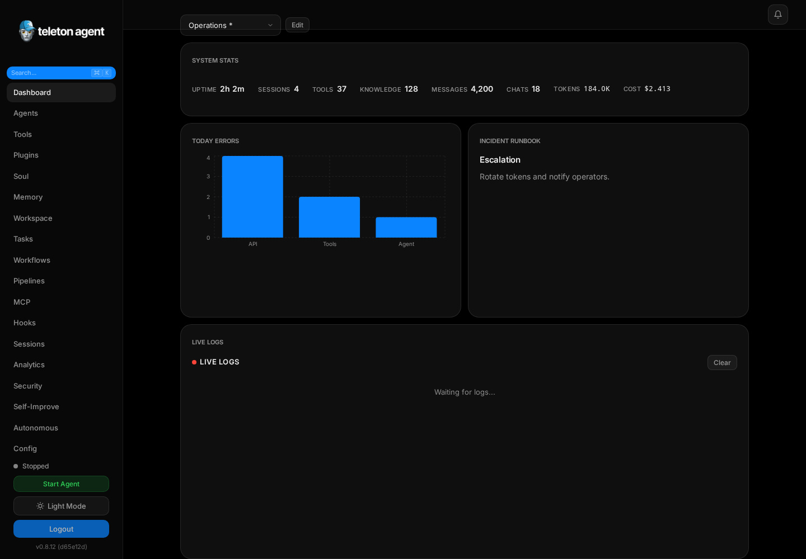
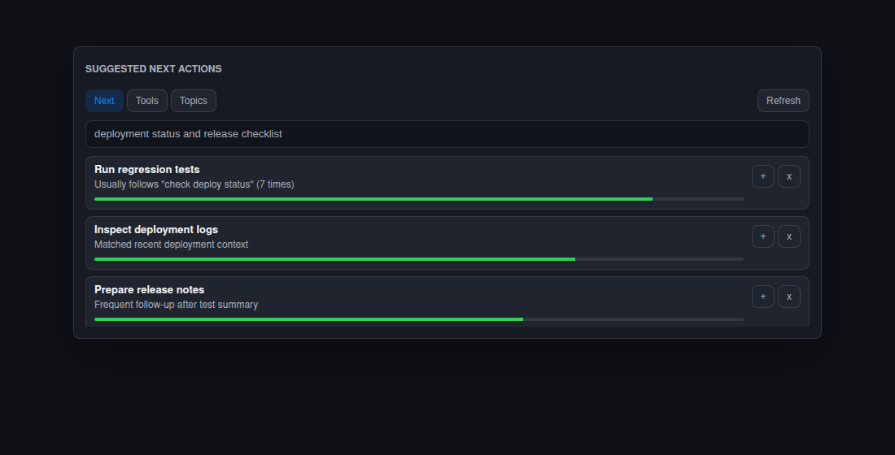
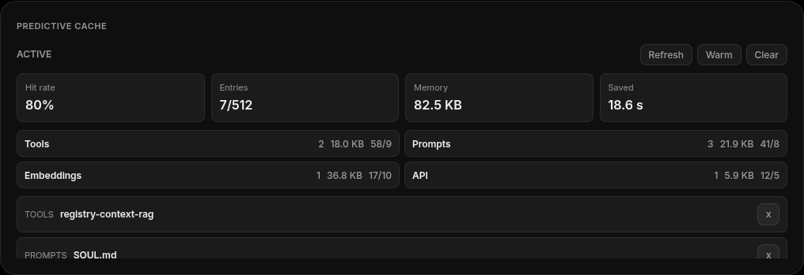

# Dashboard

Dashboard - главный экран управления WebUI. Он объединяет статус, live logs, quick actions, метрики, динамические виджеты, состояние кэша, prediction подсказки и health checks.

## Скриншоты

## Что отображается

Верхняя область показывает текущий provider, model, uptime, sessions, tool count, token usage и service health. Виджеты могут показывать status cards, logs, charts, prediction suggestions, cache resources и сгенерированные custom views.

Боковое меню остается доступным для навигации, start/stop агента, переключения темы и logout. Command palette открывается через поиск или `Ctrl+K` / `Cmd+K`.

## Ежедневный workflow

1. Проверьте состояние агента в нижней части sidebar.
2. Просмотрите warning banners и unread notifications.
3. Проверьте token, tool и activity widgets на аномальные всплески.
4. Используйте Quick Actions для низкорисковых операций: export logs или cache cleanup.
5. Открывайте generated widgets, когда нужен узкий operational view.

## Управление виджетами

1. Нажмите `Edit`.
2. Добавьте встроенный виджет или сгенерируйте виджет по natural-language prompt.
3. Переместите и измените размер виджетов.
4. Выйдите из edit mode, чтобы сохранить layout.
5. Экспортируйте dashboard bundle, если layout нужен на другой установке.

Generated widgets удобны для локальных operational views: например "show failed tools this week" или "compare daily token cost by provider". Они не заменяют source-of-truth страницы Security Center и Configuration.

## Quick Actions

Типичные действия: clear cache, export logs, restart agent и send test message. Разрушающие или чувствительные операции используют confirmation dialogs.

## Хорошие привычки

- Держите компактный dashboard для ежедневной работы и отдельный diagnostic dashboard.
- Рассматривайте prediction cards как подсказки, а не автоматические approvals.
- Проверяйте Security Center после quick actions, которые меняют configuration или runtime state.
