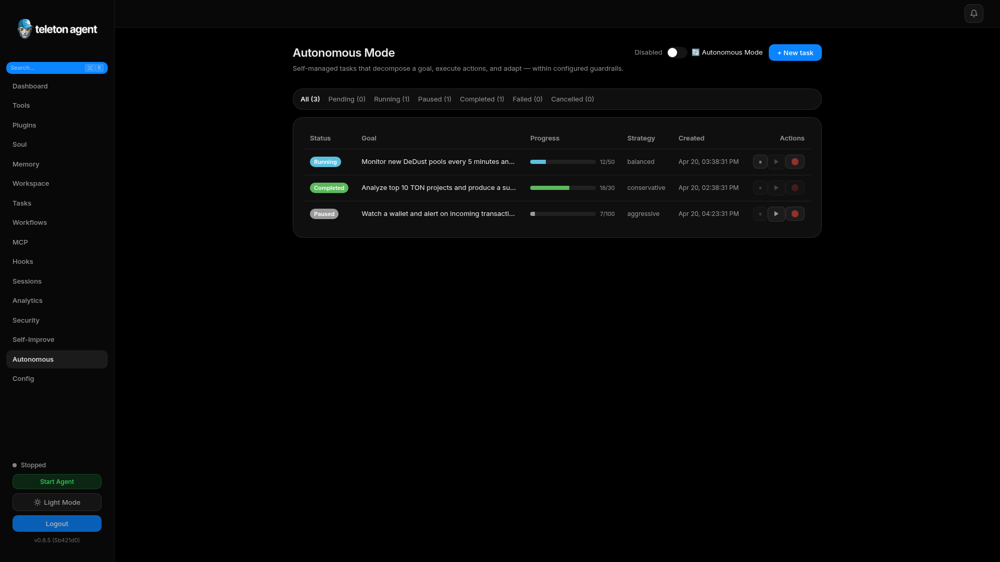
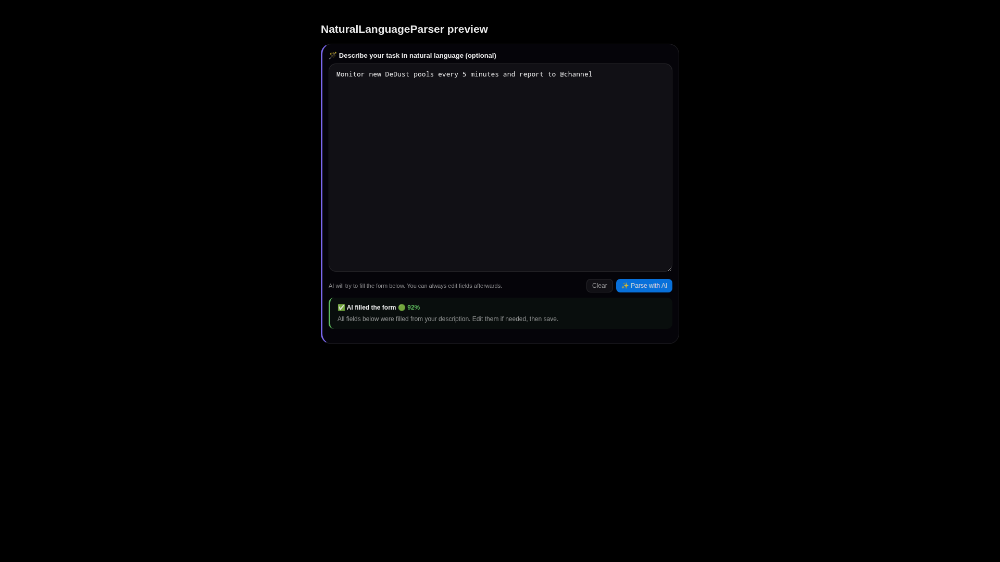

# Автономный режим

Autonomous Mode позволяет Teleton Agent выполнять долгоживущие цели через цикл plan, act, observe, reflect и checkpoint. По умолчанию режим выключен, и его стоит включать только после настройки policies и admin IDs.

## Скриншоты

## Жизненный цикл задачи

Задачи переходят через `pending`, `queued`, `running`, `paused`, `completed`, `failed` или `cancelled`. Running tasks сохраняют checkpoints, чтобы продолжить работу после restart.

## Создание задачи через AI parsing

1. Откройте `Autonomous`.
2. Нажмите `+ New task`.
3. Введите цель на естественном языке.
4. Нажмите `Parse with AI`.
5. Проверьте goal, success criteria, failure conditions, allowed tools, restricted tools, strategy, priority, iteration limit, duration limit и budget.
6. Сохраните и запустите.

## Ручное создание задачи

Используйте structured form, если нужны точные guardrails. Добавляйте один success criterion на строку и одно failure condition на строку. Высокорисковые инструменты вроде `ton_send`, `jetton_send` или `exec_run` добавляйте в restricted tools, если задача явно не требует их.

## Мониторинг прогресса

Таблица задач показывает status, goal, progress, strategy, created time и action buttons. Откройте задачу, чтобы увидеть logs, current context, checkpoints, result и errors.

Основные log event types:

| Event | Значение |
| --- | --- |
| `plan` | Агент выбрал следующее действие. |
| `tool_call` | Был вызван инструмент. |
| `tool_result` | Инструмент вернул результат. |
| `reflect` | Агент оценил прогресс. |
| `checkpoint` | Состояние восстановления сохранено. |
| `escalate` | Требуется human review. |
| `error` | Шаг завершился ошибкой. |

## Pause, Resume, Stop

Используйте pause, когда задаче нужен дополнительный context или policy change. Используйте stop, если цель больше не нужна. Остановленные или cancelled tasks лучше создавать заново, а не оживлять вручную.

## Правила безопасности

- Заполните `telegram.admin_ids`.
- Используйте `conservative` для wallet, account и exec задач.
- Указывайте budget для TON операций.
- Ограничивайте инструменты, которые могут переводить средства, писать файлы или обращаться к внешним сервисам.
- Проверяйте Security Center для approvals и audit events.
