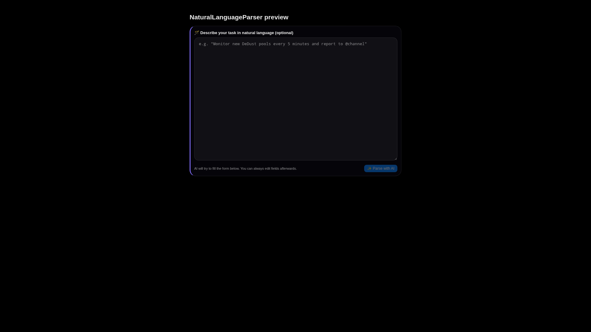

# Редактор Soul

Soul Editor редактирует prompt files, которые определяют identity, security posture, strategy, memory behavior и heartbeat tasks агента. Изменения могут повлиять на все будущие ответы.

## Скриншоты

## Prompt files

| Файл | Назначение |
| --- | --- |
| `SOUL.md` | Persona и operating style. |
| `SECURITY.md` | Safety rules и policy guidance. |
| `STRATEGY.md` | Planning preferences и tool-use strategy. |
| `MEMORY.md` | Persistent knowledge и memory instructions. |
| `HEARTBEAT.md` | Periodic autonomous checklist. |

## Edit, Preview, Split

Edit mode используется для написания, preview mode - для rendered Markdown, split mode - для проверки форматирования во время редактирования. Drafts auto-save локально, но изменения нужно сохранить, чтобы применить их к agent files.

## Templates

Templates помогают reset или specialize prompt behavior. Применяйте template только после проверки diff, потому что template может перезаписать локальный tone, constraints или domain-specific rules.

## Version history

Перед крупными prompt changes:

1. Сохраните текущую версию с коротким comment.
2. Сделайте edit.
3. Проверьте Markdown preview.
4. Сохраните новую version.
5. Используйте diff для behavior-critical sections.

Restore старую версию, если prompt change вызвал regressions: excessive tool use, unsafe replies или плохое Telegram formatting.

## Adaptive prompting

Adaptive prompting panel управляет prompt sections, variants, experiments, ratings и optimizer suggestions. Используйте его для measured improvements, а не emergency fixes.

Рекомендуемый процесс:

1. Создайте candidate variant.
2. Запустите A/B experiment с ограниченным traffic.
3. Дождитесь достаточного числа samples.
4. Promote только при улучшении quality и task success.

## Safety notes

- Делайте security rules конкретными.
- Избегайте инструкций, которые обходят confirmation или audit controls.
- Держите examples короткими и типичными.
- Записывайте причину каждой major prompt version.
