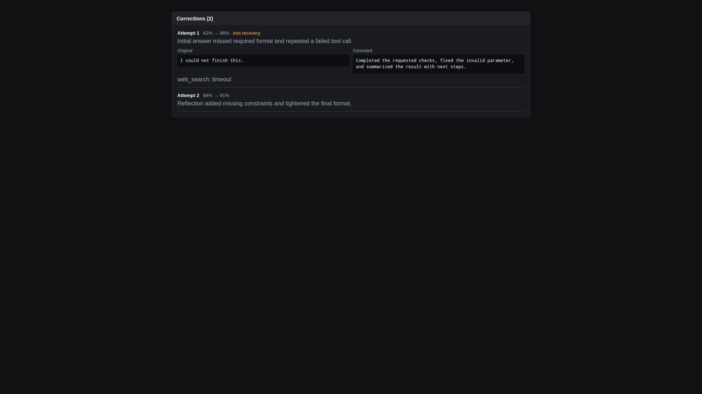

# Сессии

Sessions показывает историю чатов и conversation metadata, которые записал агент. Раздел используется для support, context recovery, audit и понимания причин действий агента.

## Скриншоты

## Список сессий

Каждая session включает chat ID, title, username, chat type, provider, model, message count, token counts, start time и last update time. Search помогает находить sessions по message content.

## Просмотр сессии

Откройте session, чтобы увидеть messages по порядку. Messages показывают источник user или agent, наличие media, edit state, timestamps и reply relationships.

## Восстановление контекста

Используйте sessions, когда пользователь спрашивает, почему агент повел себя определенным образом. Прочитайте последний user request, tool results и agent reply до изменения prompts или policies.

## Export session

Export sessions полезен для offline audit или support handoff. Считайте exports чувствительными: они могут содержать Telegram usernames, message text, media metadata и operational decisions.

## Corrections

Self-correction records показывают original output, evaluation score, reflection, corrected output, escalation state и tool recovery guidance. Используйте этот view, чтобы понять, улучшил ли self-correcting loop ответ или нужны prompt changes.

## Хорошие практики

- Фильтруйте по chat type перед широким review.
- Используйте search terms из пользовательской формулировки, а не внутренние labels.
- Export только те sessions, которые нужны для investigation.
- Не вставляйте sensitive session exports в публичные issues.
- Если session раскрывает policy gap, сначала обновите Security Center, затем Soul Editor.
