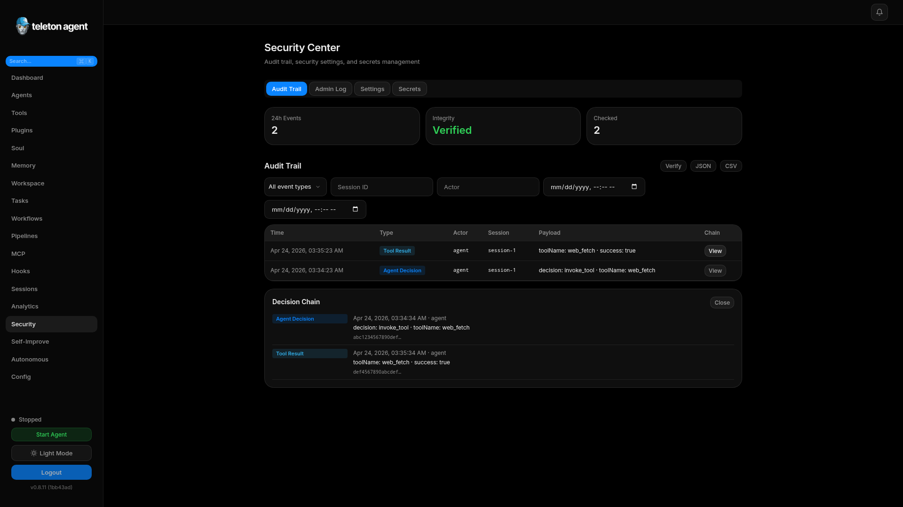
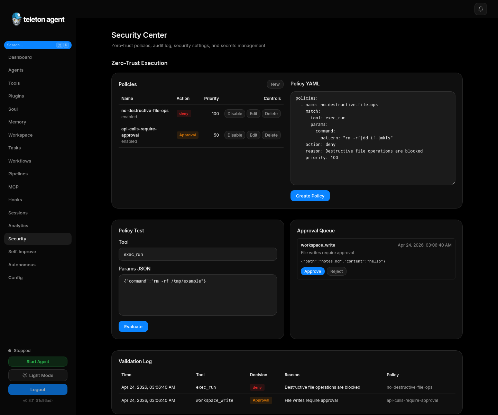

# Центр безопасности

Security Center - центральное место для audit и policies. Используйте его для просмотра administrative mutations, zero-trust decisions, approval queues, validation logs, secrets и WebUI access controls.

## Скриншоты

## Audit Trail

Audit trail записывает важные events с timestamps, actors, actions, targets, payloads и chain data. Verification помогает найти broken hash chains, а chain view - посмотреть decision path вокруг одного event.

## Audit Log

Audit log фокусируется на WebUI administrative activity. Он отвечает на вопросы: кто изменил setting, установил plugin, изменил policy или approved sensitive operation.

## Zero-trust policies

Policies match по tool, module или parameter и возвращают одно из действий:

| Action | Значение |
| --- | --- |
| `allow` | Операция может продолжаться. |
| `deny` | Операция заблокирована. |
| `require_approval` | Перед выполнением нужен human approval. |

Wallet, workspace write/delete, exec, external API mutation и account-control tools держите за explicit policies.

## Approval queue

Pending approvals показывают tool, parameters, requester, reason, policy и creation time. Approve только если операция соответствует намерению пользователя и текущему risk tolerance.

## Validation log

Validation log - самый быстрый способ понять, почему tool call был allowed, denied или escalated. Используйте его после policy changes.

## Security settings

Security settings включают session timeout, IP allowlist и WebUI rate limit. Держите WebUI на localhost, если нет защищенного reverse proxy и сильной operational причины.

## Secrets management

Secrets храните через secrets UI или plugin-specific secret controls, а не в prompt files, screenshots или exported session logs.

## Incident checklist

1. Export relevant audit trail records.
2. Verify audit chain.
3. Inspect policy validation для affected tool.
4. Rotate exposed secrets при необходимости.
5. Tighten tool scopes и policies перед resume autonomous tasks.
