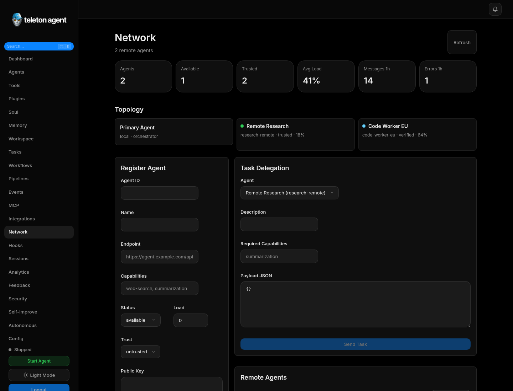
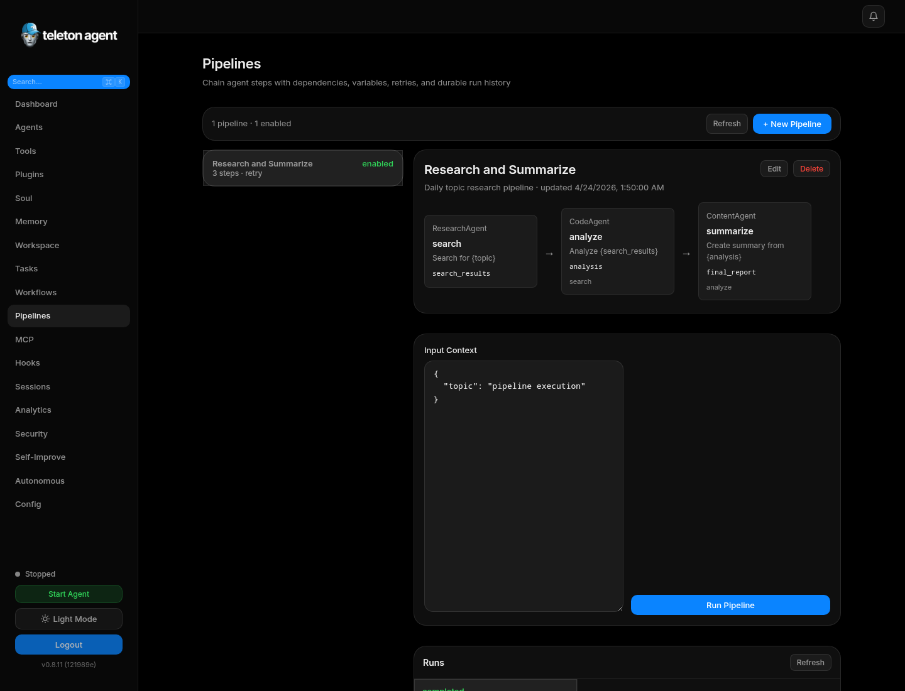
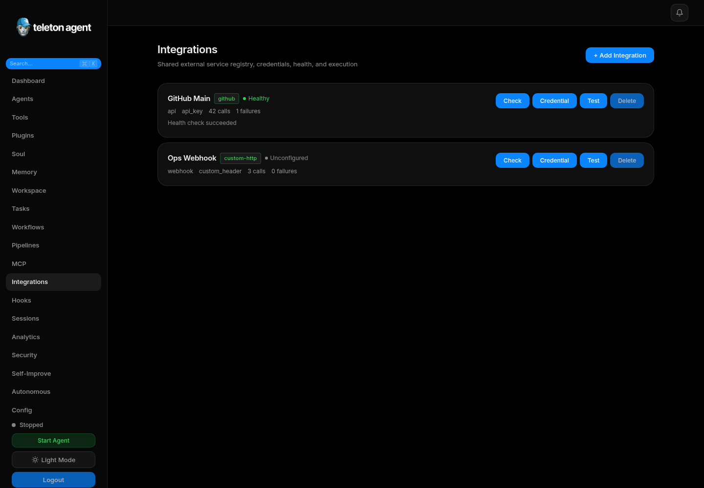
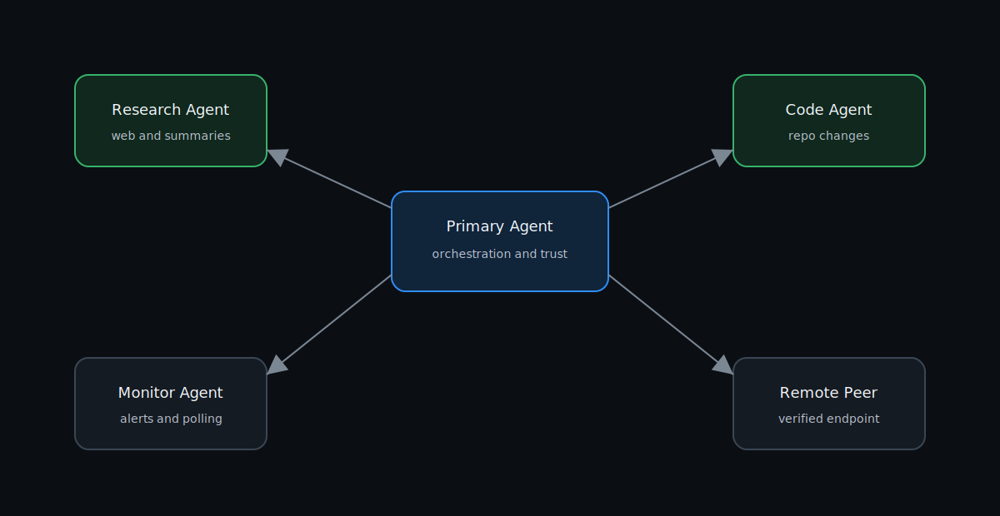
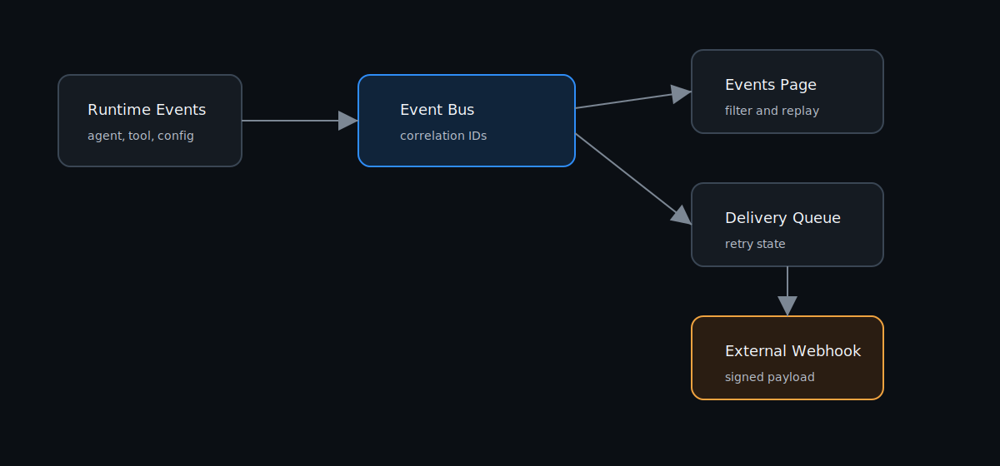

# Продвинутые функции

Этот раздел покрывает WebUI области, которые расширяют core dashboard: multi-agent operations, memory management, workflow automation, integrations и self-improvement.

## Скриншоты

## Multi-Agent Network

Используйте `Network`, чтобы регистрировать remote agents, просматривать topology, trust levels, block peers, delegate tasks и message logs. Capabilities и trust level должны определять delegation decisions.

## Agents

Страница `Agents` управляет primary и managed agents. Она покрывает archetypes, transport mode, bot token validation, personal account authentication, resource policy, messaging policy, logs и messages.

## Memory

Memory включает source files, chunks, priority scores, graph relationships, vector sync, cleanup и pins. Graph view помогает искать связи, priority view - решать, что pin или prune.

## Workspace

Workspace - file browser sandboxed agent workspace. Используйте его для reports, generated files, task artifacts и safe manual edits. Не храните secrets в workspace files.

## Workflows

Workflows автоматизируют cron, event или webhook-triggered actions. Action types включают send Telegram messages, call APIs и set variables.

## Pipelines

Pipelines выполняют multi-step processes с timeouts, retries, typed steps, run history, cancellation и detail views. Они хорошо подходят для repeatable research или reporting chains.

## Events and Webhooks

Events записывает internal activity. Webhooks доставляют выбранные event types на external URLs с retry tracking. Для inbound webhook triggers используйте signed secrets.

## MCP Servers

MCP подключает external tool servers через stdio, SSE или Streamable HTTP. Внимательно задавайте package, arguments, scope и environment variables.

## Plugins

Plugins добавляют tools через manifests и Plugin SDK. Перед включением plugin в production проверьте source, permissions, secrets и tool scopes.

## Self-Improvement

Self-Improvement анализирует repositories, documentation, plugins и tasks. Держите automation conservative и используйте pull requests для каждого generated change.
