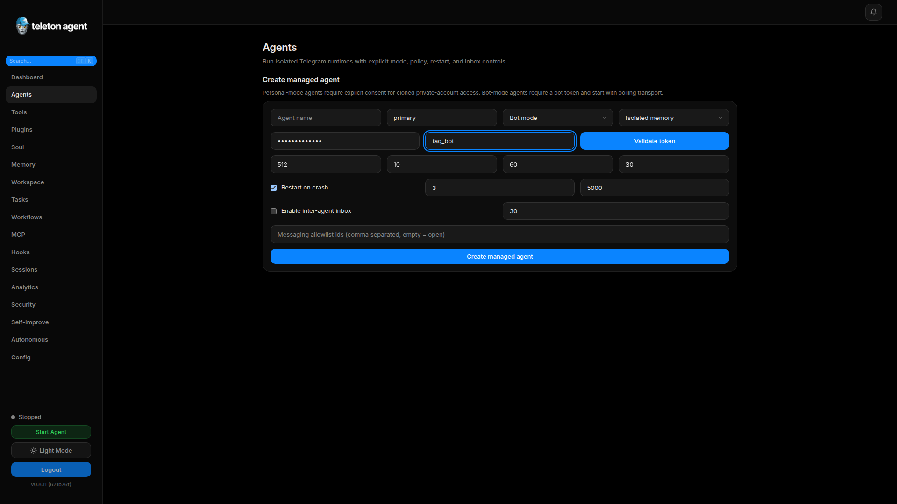

# Настройки

Configuration управляет agent provider, Telegram policies, command permissions, memory, integrations, WebUI behavior, TON proxy, MTProto proxy и export/import.

## Скриншоты

## Configuration tabs

| Область | Что настраивать |
| --- | --- |
| LLM | Provider, model, utility model, API keys, temperature, iteration limits. |
| Telegram | DM policy, group policy, mentions, allowlists, admin IDs, bot token. |
| Commands | Admin commands, allowed users, allowed chats. |
| Memory | Vector memory, Upstash settings, namespace, sync behavior. |
| Execution | System execution mode и allowed command prefixes. |
| WebUI | Port, request logging, auth token behavior. |
| MCP | Enablement и server-related configuration. |
| TON Proxy | `.ton` browsing proxy status и port. |
| Export/Import | Перенос configuration, hooks и prompt state между установками. |

## Provider changes

Provider changes gated, если target provider требует key. Введите key, validate it, затем save. Если key не нужен, change можно save directly.

## Telegram policies

Рекомендуемые production defaults:

- `dm_policy: admin-only` или `allowlist`.
- `group_policy: allowlist`, если public group operation не является явной целью.
- `require_mention: true`.
- Непустой `admin_ids`.

## Memory settings

Vector memory может работать локально или через Upstash Vector. Проверьте, что index dimension совпадает с embedding provider. После изменения vector settings запустите sync из Memory.

## Import and Export

Делайте export перед крупными changes. Import только из доверенных источников: imported hooks, prompts и tool settings могут серьезно изменить behavior агента.

## Restart requirements

Некоторые settings hot-reload immediately. Другие требуют agent restart. UI помечает restart-sensitive settings, а agent control в sidebar может перезапустить runtime.
