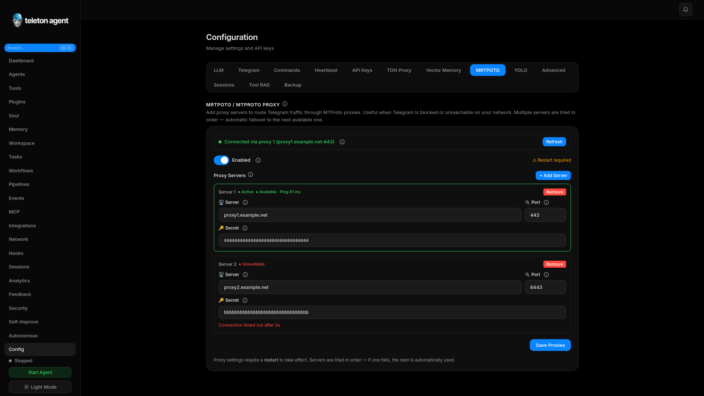

# Устранение неполадок

Используйте этот раздел, когда WebUI, agent runtime, Telegram connection, tools, memory или autonomous tasks работают не так, как ожидается.

## Скриншоты

## WebUI login fails

- Проверьте, что используете current token или startup exchange link.
- Перезапустите `teleton start --webui` и откройте напечатанный local URL.
- Проверьте, что browser не блокирует local cookies.
- Если используете reverse proxy, проверьте cookies и убедитесь, что WebUI не открыт публично.

## Agent does not respond

- Проверьте sidebar state и запустите agent, если он stopped.
- Посмотрите Dashboard health checks.
- Проверьте Telegram session и policies.
- Убедитесь, что user или chat разрешен DM/group policy.
- Проверьте recent logs и Sessions.

## Autonomous Mode does not start

- Убедитесь, что `telegram.admin_ids` содержит минимум один ID.
- Проверьте Security Center на denied tools или pending approvals.
- Проверьте, что task имеет достаточный iteration и duration budget.
- Явно задайте restricted tools.

## Telegram auth problems

- Проверьте API ID, API hash, phone number и code.
- Если включен 2FA, введите password в wizard.
- Если сеть блокирует Telegram, настройте MTProto proxy.
- Для bot mode проверьте bot token и username.

## Tools fail

- Откройте Tools и проверьте enabled state и scope.
- Используйте tool details для просмотра parameters и recent failures.
- Проверьте Security Center validation logs.
- Для plugin tools проверьте plugin secrets и dependencies.

## Memory or vector sync fails

- Проверьте, что локальные SQLite files доступны для записи.
- Проверьте Upstash URL, token, namespace и vector dimension.
- После исправления credentials запустите vector sync снова.
- Pin important memories перед cleanup.

## Cost or latency spikes

- Откройте Analytics и сравните token usage, tool usage и performance за 24 hours.
- Проверьте, не зациклились ли autonomous tasks.
- Уменьшите iteration limits или pause noisy tasks.
- Используйте cache widgets для проверки hit rate.

## Когда эскалировать

Обращайтесь к maintainers с exact version, config area, reproduction steps, logs, screenshots и указанием affected области: Telegram, TON, memory, tools или только WebUI.
