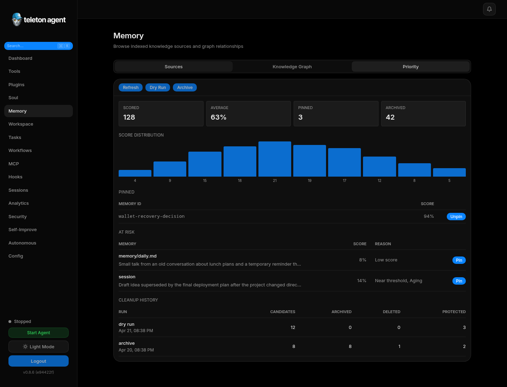

# FAQ и лучшие практики

## Скриншоты

## FAQ

### Выбирать user mode или bot mode?

User mode нужен для полного Telegram account access, dialogs, history, media и advanced Telegram features. Bot mode подходит, когда важнее lower account risk и simpler deployment.

### Почему требуется `telegram.admin_ids`?

Autonomous actions должны быть привязаны к реальному administrator. Без admin IDs autonomous manager и heartbeat не могут безопасно отправлять escalations или выполнять admin-only tool calls.

### Можно ли открыть WebUI в интернет?

Не открывайте напрямую. Держите WebUI на localhost или используйте hardened reverse proxy, TLS, strong auth, IP controls и monitoring.

### Сколько tools включать?

Включайте только tools, которые агенту реально нужны. Tool RAG помогает передавать модели релевантные инструменты, но dangerous tools все равно нужно ограничивать scope и Security Center policies.

### Как контролировать cost?

Задавайте разумные iteration limits, используйте дешевый utility model, следите за Analytics, держите cache включенным и pause looping autonomous tasks.

### Куда писать долгосрочные инструкции?

Используйте Soul Editor для behavior и policy instructions. Используйте Memory для factual long-term context. Используйте Configuration для settings. Не прячьте settings или secrets в prompts.

## Лучшие практики

### Security

- Используйте отдельный Telegram account.
- Держите wallet tools approval-gated.
- Держите exec off, пока он явно не нужен.
- Rotate secrets после случайного раскрытия.
- Проверяйте audit logs после каждого production change.

### Operations

- Начинайте день с Dashboard.
- Проверяйте pending approvals перед autonomous work.
- Держите один focused dashboard для ежедневной работы.
- Используйте Workflows и Pipelines для repeatable procedures.
- Export config перед major changes.

### Prompt management

- Сохраняйте prompt versions перед edits.
- Используйте A/B experiments для tone changes.
- Делайте security prompts конкретными.
- Не дублируйте configuration в prompt instructions.

### Memory

- Pin durable facts.
- Периодически clean stale memory.
- Sync vectors после изменения embedding или Upstash settings.
- Используйте Sessions для recent context и Memory для durable knowledge.

### Autonomous tasks

- Пишите measurable success criteria.
- Задавайте failure conditions.
- Ограничивайте risky tools.
- Используйте pause, а не delete, когда нужен дополнительный context.
- Проверяйте checkpoints перед restart failed work.
